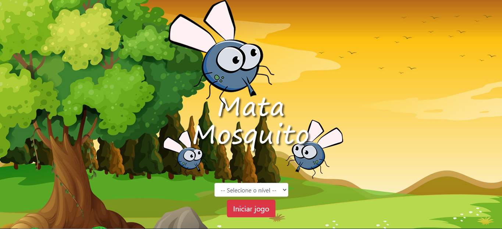
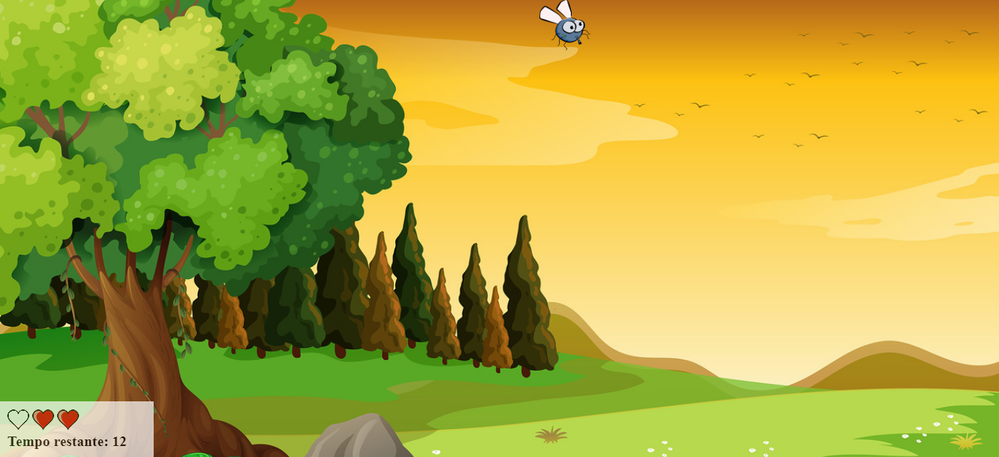
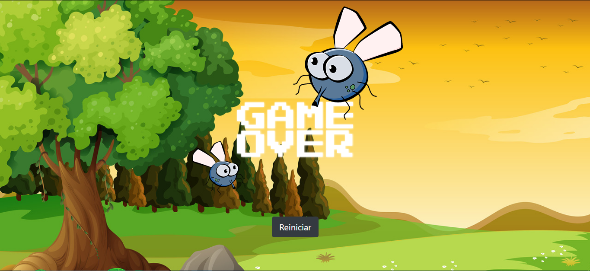

# Mata Mosquito 

## Sobre o desenvolvimento
Projeto feito para fins didáticos e prática da linguagem JavaScript. O desenvolvimento desse projeto foi feito usando as tecnologias:

### Tecnologias: <h3> 
* HTML
* CSS - Criação de estilos e costumizações.

### Linguagem de programação: <h3>
* JavaScript - Programar o jogo atráves de scripts internos e em maioria por scripts externos.

### Frameworks: <h3>
* Bootstrap - Utilização da ferramenta Grid para criação de layouts responsivos, criação de botões básicos atráves das classes nátivas do Bootstrap em algumas páginas principais. 

>Observações: O foco deste projeto foi o treinamento e prática da linguagem JavaScript. Por isso a escolha de utilizar estilos basicos e classes nativas do Bootstrap para a criação de alguns elementos da página, pois o foco do projeto está em sua lógica de programação.

## Sobre o Game

A lógica do jogo é simples: haverá mosquitos que serão gerados de maneira aleatória em toda área utíl dá página, seu objetivo é matar todos enquanto o tempo de 15 segundos durar, se os mosquitos desaparecerem sem que tenha dado tempo de mata-lo, você perderá um ponto de vida, caso perdido três pontos de vida o jogo dará game over, caso você tenha mantido seus pontos de vidas até que acabe o tempo, o jogo irá exibir uma tela de vitória.

O jogo é composto por três dificuldades:

* Normal - 1,5 segundos de intervalo entre o spawn de cada mosquito.
* Dificil - 1 segundo de intervalo entre o spawn de cada mosquito.
* Extremo - 0,75 segundos (750 milésimos) de intervalo entre o spawn de cada mosquito.

A dificuldade poderá ser escolhida na tela principal do jogo.

## Previews

    
    
    

